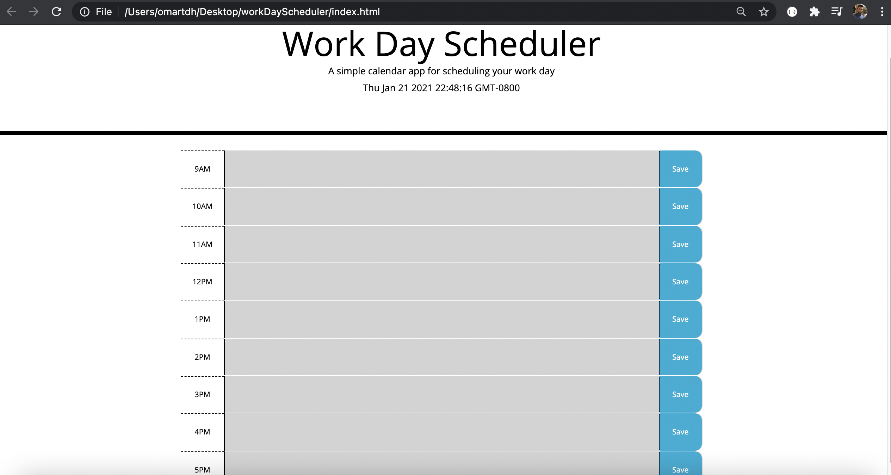
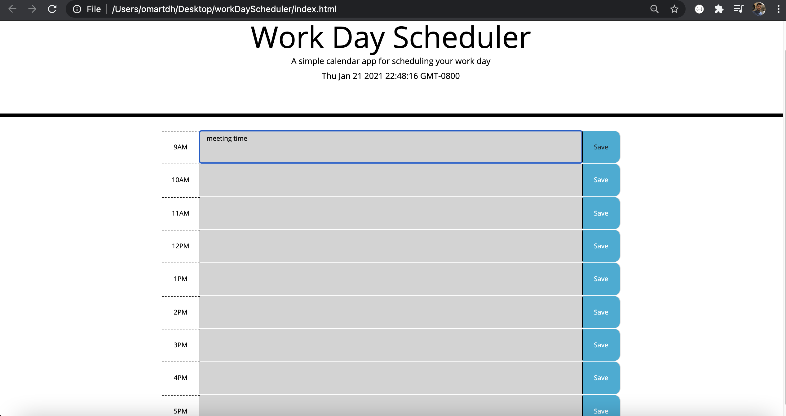

# workDayScheduler

## File

* [`work-day-scheduler`](index.html)

* completed the necessary HTML code to add the hours blocks using the classes that already provided in the (style.css) file.

* Created the JavaScript logic that will allow the used to input information into every hour discription area, and have it saved in the local storage so when they refresh the page the info will still showing.

* designed the hours blocks to be showing different colors pased on the time, if its in the past it will show gray, if its current time it will show red, and if it's future it will show green.

;

;